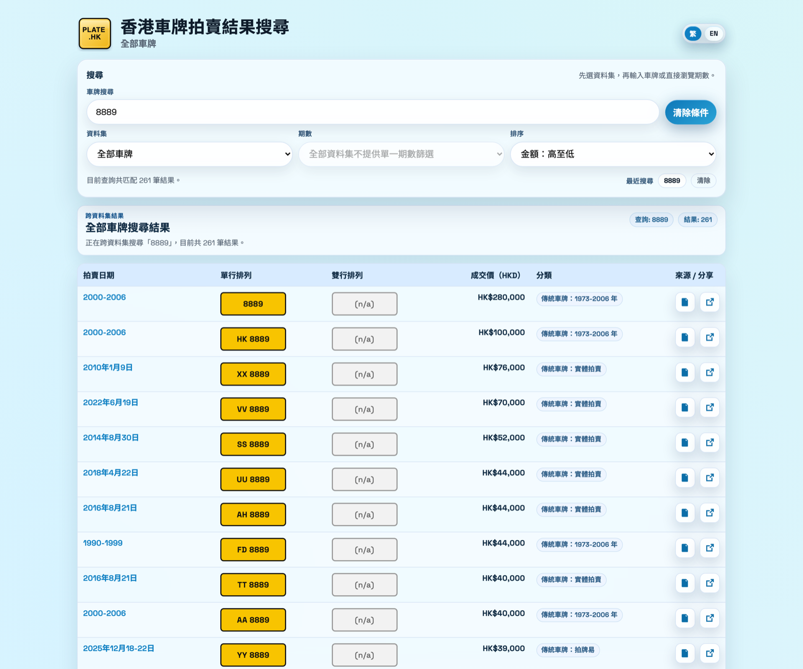
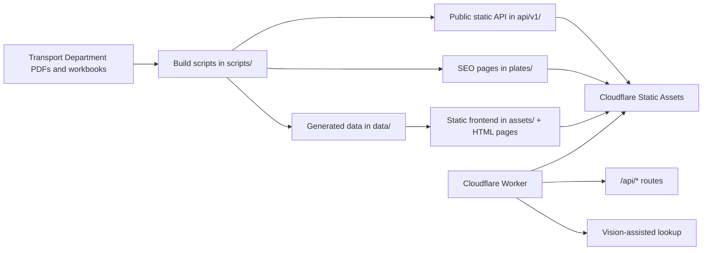

# Plate.hk



[](./LICENSE)


Open-source search, audit, and publishing pipeline for Hong Kong vehicle registration mark auction results.

Plate.hk turns Transport Department source documents into a searchable static website, a public JSON API, SEO landing pages, and Cloudflare-ready deployment artifacts. The repository covers personalized marks, traditional TVRM auctions, E-Auction records, historical legacy ranges, and camera-assisted lookup.

## Live project

- Site: [https://plate.hk/](https://plate.hk/)
- API docs: [https://plate.hk/api.html](https://plate.hk/api.html)
- Data audit: [https://plate.hk/audit.html](https://plate.hk/audit.html)
- Changelog: [https://plate.hk/changelog.html](https://plate.hk/changelog.html)

## Project docs

- Contribution guide: [CONTRIBUTING.md](./CONTRIBUTING.md)
- Security posture: [SECURITY.md](./SECURITY.md)
- OpenAPI spec: [api/openapi.yaml](./api/openapi.yaml)

## At a Glance

- Public-facing search experience for Hong Kong plate auction history
- Verifiable source links back to official Transport Department documents
- Static-first architecture with Cloudflare Worker APIs and prebuilt JSON shards
- Built-in audit surface for source coverage, parse quality, and release confidence

## Product Preview


## What This Repo Includes

- Searchable auction data for Hong Kong plate sales across multiple datasets
- A static frontend with issue shards, hot-search caches, and SEO pages
- A public `/api/v1` JSON surface for dataset browsing
- Camera-assisted lookup via the Cloudflare Worker runtime
- OAuth 2.0 client-credentials discovery for protected OCR access
- OAuth Protected Resource Metadata for agent auth discovery
- MCP Server Card plus a streamable HTTP `/mcp` transport for agent tool discovery
- Build scripts for ingestion, normalization, validation, and release packaging

## Data Coverage

- `PVRM`: personalized vehicle registration marks
- `TVRM physical`: traditional plate live auctions
- `TVRM E-Auction`: 拍牌易 records
- `TVRM legacy`: historical `1973-2006` year-range records

## Quick Start

Prerequisites:

- Python 3
- Node.js and npm

Install dependencies:

```bash
python3 -m pip install --user -r requirements.txt
npm install
```

Build the site and generated artifacts:

```bash
./scripts/build_site.sh
```

Run locally:

```bash
./scripts/run_local.sh 8080
```

Open [http://127.0.0.1:8080](http://127.0.0.1:8080), then stop the server with:

```bash
./scripts/stop_local.sh 8080
```

## Common Commands

| Task | Command |
| --- | --- |
| Rebuild all site assets and generated data | `./scripts/build_site.sh` |
| Run syntax checks and tests | `./scripts/check_site.sh` |
| Run secrets and dependency security checks | `./scripts/check_security.sh` |
| Build Cloudflare static publish directory | `python3 scripts/build_cloudflare_public.py` |
| Start local Cloudflare Worker dev | `npm run cf:dev` |
| Deploy Cloudflare Worker | `npm run cf:deploy` |
| Build release archive | `./scripts/package_release.sh` |
| Fast release smoke check | `./scripts/release_ready.sh --fast` |

## Architecture

The current production shape is:

- Cloudflare Static Assets serves the frontend and prebuilt public data
- Cloudflare Worker handles `/api/*` routes and the vision-assisted lookup flow
- Static JSON shards power search, issue browsing, and high-frequency cached queries
- SEO pages under `plates/` expose popular plate result pages to search engines

The repository also keeps legacy PHP and shared-host tooling where needed for compatibility, migration, and admin-side workflows.



## Why It Feels Professional

- Static artifacts are generated, validated, and packaged from a reproducible pipeline
- Search results are designed to be traceable back to the official published source
- Cloudflare-ready deployment keeps the runtime small while preserving a public data surface
- Audit and security workflows are documented in-repo instead of living in tribal knowledge

## Repository Guide

| Path | Purpose |
| --- | --- |
| `assets/` | Frontend JavaScript, styles, and page-specific UI logic |
| `data/` | Generated data, audit reports, search indexes, and workbook sources |
| `api/v1/` | Public static API payloads derived from generated data |
| `plates/` | Generated SEO landing pages for popular plates |
| `cloudflare-worker/` | Worker runtime for API routes and vision lookup |
| `scripts/` | Build, validation, packaging, and data-update scripts |

## Key Generated Outputs

These are the artifacts most contributors need to understand:

| Output | Purpose |
| --- | --- |
| `data/issues.manifest.json` and `data/issues/*.json` | PVRM issue shards used by the frontend |
| `data/tvrm_physical/issues.manifest.json` and `data/tvrm_physical/issues/*.json` | Physical TVRM issue shards |
| `data/tvrm_eauction/issues.manifest.json` and `data/tvrm_eauction/issues/*.json` | E-Auction issue shards |
| `data/tvrm_legacy/issues.manifest.json` and `data/tvrm_legacy/issues/*.json` | Historical year-range TVRM shards |
| `data/all.search.meta.json` | Aggregate search metadata |
| `data/all.prefix1.top200.json` | Lightweight preview index for broad “all plates” queries |
| `data/hot_search/` | Cached results for high-frequency queries such as `88`, `8888`, and `HK` |
| `data/all.tvrm_legacy_overlap.json` | Deduplication hints for cross-dataset aggregation |
| `data/audit.json` | Audit view payload listing source coverage and parse quality |
| `api/v1/` | Static API payloads consumed by external clients and the site |

The historical workbook sources remain in-repo because they are still part of the build graph:

- `data/TVRM auction result (1973-2026).xls`
- `data/TVRM auction result (2006-2026).xlsx`

## Data Source and Verification

Plate.hk is built from Hong Kong Transport Department publications and bundled legacy workbook sources.

- Official source documents remain the source of truth
- Search results link back to the original source document for manual verification
- If a generated record disagrees with an official handout or workbook, the official publication should prevail

## Updating Data

When new auction records are published, rebuild the generated artifacts before opening a PR:

```bash
python3 scripts/build_dataset.py
python3 scripts/build_tvrm_dataset.py
python3 scripts/build_tvrm_legacy_dataset.py
python3 scripts/build_all_results_preset.py
python3 scripts/build_all_search_index.py
python3 scripts/build_hot_search_cache.py
python3 scripts/build_popular_plate_pages.py
python3 scripts/build_public_api.py
python3 scripts/build_audit_report.py
python3 scripts/verify_data_integrity.py
```

For the contributor workflow, review [CONTRIBUTING.md](./CONTRIBUTING.md).

## Security

- Review [SECURITY.md](./SECURITY.md) before changing public endpoints, OCR flows, or deployment boundaries
- Run `python3 scripts/scan_repo_secrets.py` if you touched config, CI, or API-adjacent code
- Do not commit credentials, tokens, or local environment files
- Protected agent-facing OCR auth is published via `/.well-known/oauth-protected-resource`, `/.well-known/oauth-authorization-server`, and `/.well-known/jwks.json`
- The worker expects `OAUTH_CLIENTS_JSON`, `OAUTH_JWT_PRIVATE_JWK`, and `OAUTH_JWKS_JSON` to issue and verify bearer tokens for `/api/vision_plate`
- The worker now also serves a public MCP transport at `/mcp` with discovery at `/.well-known/mcp/server-card.json` and `/.well-known/mcp-server-card`

## License

[MIT](./LICENSE)
