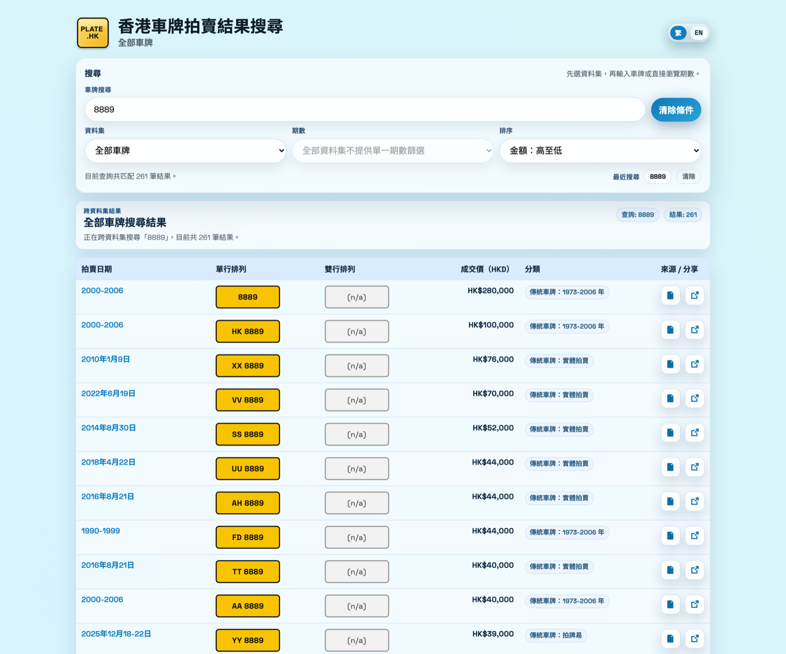
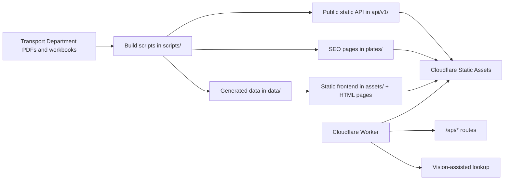

# Plate.hk



[](./LICENSE)


Open-source search, audit, and publishing pipeline for Hong Kong vehicle registration mark auction results.

Plate.hk turns Transport Department source documents into a searchable static website, a public JSON API, SEO landing pages, and Cloudflare-ready deployment artifacts. The repository covers personalized marks, traditional TVRM auctions, E-Auction records, historical legacy ranges, and camera-assisted lookup.

The current public UI uses a flat Ledger visual system: compact auction-record tables, square Hong Kong plate branding, dense generated plate pages, and bilingual legal/policy pages designed to stay calm and source-first rather than decorative.

## Live project

- Site: [https://plate.hk/](https://plate.hk/)
- Data guide and methodology: [https://plate.hk/about.html](https://plate.hk/about.html)
- API docs: [https://plate.hk/api.html](https://plate.hk/api.html)
- MCP docs: [https://plate.hk/mcp.html](https://plate.hk/mcp.html)
- Data audit: [https://plate.hk/audit.html](https://plate.hk/audit.html)
- Changelog: [https://plate.hk/changelog.html](https://plate.hk/changelog.html)
- Popular plates: [https://plate.hk/plates/](https://plate.hk/plates/)

## Project docs

- Contribution guide: [CONTRIBUTING.md](./CONTRIBUTING.md)
- Security posture: [SECURITY.md](./SECURITY.md)
- Maintainer update workflow: [UPDATE.md](./UPDATE.md)
- Cloudflare Worker handover: [CLOUDFLARE_WORKERS_HANDOVER.md](./CLOUDFLARE_WORKERS_HANDOVER.md)
- API implementation notes: [api/README.md](./api/README.md)
- OpenAPI spec: [api/openapi.yaml](./api/openapi.yaml)
- MCP implementation notes: [mcp/README.md](./mcp/README.md)
- Agent guide and public skill: [agent.md](./agent.md), [skill.md](./skill.md)
- SEO/AEO measurement baseline: [docs/SEO_AEO_BASELINE.md](./docs/SEO_AEO_BASELINE.md)
- Historical handoffs and recovery notes: [docs/](./docs/)

## At a Glance

- Public-facing search experience for Hong Kong plate auction history
- Verifiable source links back to official Transport Department documents
- Static-first architecture with Cloudflare Worker APIs and prebuilt JSON shards
- Built-in audit surface for source coverage, parse quality, and release confidence
- Flat Ledger UI tuned for auction records, compact tables, generated plate pages, and share posters

## Product Preview


## What This Repo Includes

- Searchable auction data for Hong Kong plate sales across multiple datasets
- A static frontend with issue shards, hot-search caches, and SEO pages
- Source-grounded Dataset and Breadcrumb structured data on generated plate pages
- Agent-readable citation guidance through `llms.txt`, `agent.md`, API discovery, and MCP
- A public `/api/v1` JSON surface for dataset browsing
- Camera-assisted lookup via the Cloudflare Worker runtime
- Privacy-minimised external sale signals with an exact-plate WhatsApp buyer-enquiry flow
- OAuth 2.0 client-credentials discovery for protected OCR access
- OAuth Protected Resource Metadata for agent auth discovery
- MCP Server Card plus a streamable HTTP `/mcp` transport for agent tool discovery
- Bilingual Terms and Privacy pages that document analytics, OCR, APIs, share posters, local storage, and source verification boundaries
- Build scripts for ingestion, normalization, validation, and release packaging

## Data Coverage

- `PVRM`: personalized vehicle registration marks
- `TVRM physical`: traditional plate live auctions
- `TVRM E-Auction`: 拍牌易 records
- `TVRM legacy`: historical `1973-2006` year-range records

## Quick Start

Prerequisites:

- Python 3.10+ (CI uses Python 3.12)
- Node.js and npm

Install dependencies:

```bash
python3 -m pip install --user -r requirements.txt
npm install
```

Build the site and generated artifacts:

```bash
./scripts/build_site.sh
```

Run locally:

```bash
./scripts/run_local.sh 8080
```

Open [http://127.0.0.1:8080](http://127.0.0.1:8080), then stop the server with:

```bash
./scripts/stop_local.sh 8080
```

## Common Commands

| Task | Command |
| --- | --- |
| Rebuild all site assets and generated data | `./scripts/build_site.sh` |
| Run syntax checks and tests | `./scripts/check_site.sh` |
| Run secrets and dependency security checks | `./scripts/check_security.sh` |
| Check generated duplicate artifacts | `python3 scripts/check_duplicate_generated_artifacts.py` |
| Initialize private SEO/AEO measurement templates | `python3 scripts/build_seo_aeo_baseline.py --init` |
| Build the private SEO/AEO scorecard | `python3 scripts/build_seo_aeo_baseline.py` |
| Refresh a bounded 28car signal slice | `python3 scripts/scrape_28car_market.py --max-pages 25` |
| Refresh all reported 28car listing pages | `python3 scripts/scrape_28car_market.py --max-pages 0` |
| Compare production freshness against local outputs | `python3 scripts/check_production_freshness.py --fail-on-drift` |
| Build Cloudflare static publish directory | `python3 scripts/build_cloudflare_public.py` |
| Start local Cloudflare Worker dev | `npm run cf:dev` |
| Check Cloudflare Worker secrets | `npm run cf:secrets:check` |
| Deploy Cloudflare Worker | `npm run cf:deploy` |
| Deploy Cloudflare Worker from CI | `npm run cf:deploy:ci` |
| Build release archive | `./scripts/package_release.sh` |
| Fast release smoke check | `./scripts/release_ready.sh --fast` |

## Architecture

The current production shape is:

- Cloudflare Static Assets serves the frontend and prebuilt public data
- Cloudflare Worker handles `/api/*` routes and the vision-assisted lookup flow
- The Worker performs exact-plate lookups against a non-browsable, minimal external-sale signal asset
- Fresh exact sale signals can launch a short, client-side WhatsApp buyer-enquiry draft
- Static JSON shards power search, issue browsing, and high-frequency cached queries
- SEO pages under `plates/` expose popular plate result pages to search engines

Legacy runtime code has been removed; production and local runtime paths use the Cloudflare Worker plus static assets.

## Frontend and Design System

The production frontend is intentionally static-first and style-light:

- `assets/ledger.css` carries the current flat Ledger visual layer across the homepage, policy pages, camera page, API/audit pages, and generated plate pages
- `assets/info-shell.js` gives About, Terms, Privacy, Changelog, Audit, API, MCP, and Popular Plates one shared header, active navigation state, language-aware links, and grouped footer
- `assets/popular-index.js` adds filtering and staged disclosure to the Popular Plates index while leaving every plate link visible when JavaScript is unavailable
- `assets/logo.svg` and `assets/favicon.svg` use a square Hong Kong-style plate mark with centered `HONG / KONG` text
- Search result rows are tuned as dense auction ledger records on desktop and readable cards on mobile
- `assets/index.share.js` generates branded share posters in-browser from the current row data
- `scripts/build_popular_plate_pages.py` regenerates the `plates/` SEO pages with the same Ledger styling


```mermaid
flowchart LR
    A["Transport Department PDFs and workbooks"] --> B["Build scripts in scripts/"]
    B --> C["Generated data in data/"]
    B --> D["Public static API in api/v1/"]
    B --> E["SEO pages in plates/"]
    C --> F["Static frontend in assets/ + HTML pages"]
    D --> G["Cloudflare Static Assets"]
    E --> G
    F --> G
    H["Cloudflare Worker"] --> G
    H --> I["/api/* routes"]
    H --> J["Vision-assisted lookup"]
```

## Why It Feels Professional

- Static artifacts are generated, validated, and packaged from a reproducible pipeline
- Search results are designed to be traceable back to the official published source
- Cloudflare-ready deployment keeps the runtime small while preserving a public data surface
- Audit and security workflows are documented in-repo instead of living in tribal knowledge

## Repository Guide

| Path | Purpose |
| --- | --- |
| `assets/` | Frontend JavaScript, styles, and page-specific UI logic |
| `data/` | Generated data, audit reports, search indexes, and workbook sources |
| `api/v1/` | Public static API payloads derived from generated data |
| `plates/` | Generated SEO landing pages for popular plates |
| `cloudflare-worker/` | Worker runtime for API routes and vision lookup |
| `scripts/` | Build, validation, packaging, and data-update scripts |
| `config/seo-aeo-prompts.json` | Versioned bilingual search and AI-citation measurement corpus |

## Data Coverage

Plate.hk publishes the following datasets:

- `all`: unified cross-dataset view with `dataset_key` on every record plus deduplicated plate summaries
- `pvrm`: personalized vehicle registration marks
- `tvrm_physical`: traditional plate live auctions
- `tvrm_eauction`: 拍牌易 records
- `tvrm_legacy`: historical `1973-2006` year-range records

## Key Generated Outputs

These are the artifacts most contributors need to understand:

| Output | Purpose |
| --- | --- |
| `data/issues.manifest.json` and `data/issues/*.json` | PVRM issue shards used by the frontend |
| `data/tvrm_physical/issues.manifest.json` and `data/tvrm_physical/issues/*.json` | Physical TVRM issue shards |
| `data/tvrm_eauction/issues.manifest.json` and `data/tvrm_eauction/issues/*.json` | E-Auction issue shards |
| `data/tvrm_legacy/issues.manifest.json` and `data/tvrm_legacy/issues/*.json` | Historical year-range TVRM shards |
| `data/all.search.meta.json` | Aggregate search metadata |
| `data/all.prefix1.top200.json` | Lightweight preview index for broad “all plates” queries |
| `data/all.prefix2/`, `data/all.char1/`, and `data/all.bigram/` | Compact complete prefix and bigram indexes for fast arbitrary-plate searches |
| `data/hot_search/` | Cached results for high-frequency queries such as `88`, `8888`, and `HK` |
| `data/all.tvrm_legacy_overlap.json` | Deduplication hints for cross-dataset aggregation |
| `data/audit.json` | Audit view payload listing source coverage and parse quality |
| `data/market/28car.active.json` | Gitignored local/runner-only 28car signal snapshot: plate, price signal, listing reference/link, and freshness only |
| `api/v1/` | Static API payloads consumed by external clients and the site |

The historical workbook sources remain in-repo because they are still part of the build graph:

- `data/TVRM auction result (1973-2026).xls`
- `data/TVRM auction result (2006-2026).xlsx`

## Data Source and Verification

Plate.hk is built from Hong Kong Transport Department publications and bundled legacy workbook sources.

- Official source documents remain the source of truth
- Search results link back to the original source document for manual verification
- If a generated record disagrees with an official handout or workbook, the official publication should prevail

## Updating Data

When new auction records are published, rebuild the generated artifacts before opening a PR:

```bash
python3 scripts/build_dataset.py
python3 scripts/build_tvrm_dataset.py
python3 scripts/build_tvrm_legacy_dataset.py
python3 scripts/build_all_results_preset.py
python3 scripts/build_all_search_index.py
python3 scripts/build_hot_search_cache.py
python3 scripts/build_popular_plate_pages.py
python3 scripts/build_public_api.py
python3 scripts/build_audit_report.py
python3 scripts/verify_data_integrity.py
```

For the contributor workflow, review [CONTRIBUTING.md](./CONTRIBUTING.md).

## External Sale Signals and Buyer Mandates

The 28car ingester is intentionally narrower than a marketplace mirror. It checks `robots.txt`, applies a global request-start delay, and writes only an allowlisted signal schema. Seller names, phone numbers, comments, descriptions, photos, and view counts are discarded before the output is built.

The aggregate signal file is gitignored and must never be committed to the public repository. During the cloud update it exists only on the private GitHub Actions runner, where the publish builder validates the allowlisted offer fields and packages first-character shards under `/_market/`. The Worker blocks those shard paths from direct web access. The public surface supports one exact match with `GET /api/market_signal?plate=...` and a same-origin, page-scoped set of up to 200 exact candidates with `GET /api/market_signal?plates=...`; the batch returns positive matches only and is not a browsable market feed. The homepage uses that bounded batch so every rendered search row is checked, while generated SEO pages use the single-plate form. A sale panel and 28car source link render only for a fresh exact match; an absent panel is not evidence that no listing exists, especially when the snapshot reports partial coverage.

SEO plate pages embed source-grounded historical auction results, but external market signals contain only a hidden plate marker, never a baked asking price, listing ID, or marketplace URL. Their browser script rechecks the exact-match API on every view and renders the card only while the signal remains fresh. All `cf:deploy*` commands require a complete snapshot inside its freshness window, and cloud workflows verify one exact deployed signal plus the 404 boundary on its internal shard after deployment.

Run a bounded refresh during development:

```bash
python3 scripts/scrape_28car_market.py --max-pages 25 --concurrency 3 --request-delay 0.85
python3 scripts/build_cloudflare_public.py
```

Use `--max-pages 0` only for an intentional full scan. Full scans and `--require-complete` runs abort before writing when any requested page fails; bounded exploratory scans can retain recent prior signals while recording explicit partial coverage. A layout change, `robots.txt` restriction, or page with zero parsed records therefore cannot silently replace production with a false complete snapshot. The cloud-owned `Auto Update Data` workflow runs a required-complete privacy-minimized scan before rebuilding SEO pages each day, then deploys every successful refresh after the same repository checks pass. Market-only changes are deployed but never committed.

When a fresh exact signal exists, the buyer CTA opens a short form for the target plate, maximum budget, and an optional note. Submitting the form composes a prefilled WhatsApp message to the configured business number and opens it in a new tab. Plate.hk does not POST or store the form values; the buyer decides whether to send the draft in WhatsApp. The temporary destination is configured as `WHATSAPP_NUMBER` in `assets/index.market.js` and should be replaced when the dedicated business number is ready.

## Security

- Review [SECURITY.md](./SECURITY.md) before changing public endpoints, OCR flows, or deployment boundaries
- Run `python3 scripts/scan_repo_secrets.py` if you touched config, CI, or API-adjacent code
- Do not commit credentials, tokens, or local environment files
- Camera OCR requires the Cloudflare Worker secret `OPENAI_API_KEY`; set it with `wrangler secret put OPENAI_API_KEY` and verify it with `npm run cf:secrets:check`
- Protected agent-facing OCR auth is published via `/.well-known/oauth-protected-resource`, `/.well-known/oauth-authorization-server`, and `/.well-known/jwks.json`
- The worker expects `OAUTH_CLIENTS_JSON`, `OAUTH_JWT_PRIVATE_JWK`, and `OAUTH_JWKS_JSON` to issue and verify bearer tokens for `/api/vision_plate`
- The worker now also serves a public MCP transport at `/mcp` with discovery at `/.well-known/mcp/server-card.json` and `/.well-known/mcp-server-card`

## License

[MIT](./LICENSE)
