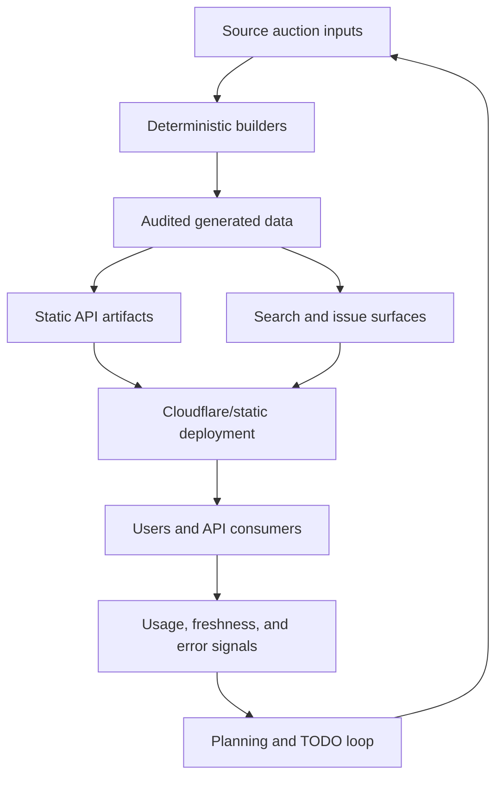

<!-- /autoplan restore point: <local gstack artifact> -->
# Plate.hk Recovery Plan

Date: 2026-05-06
Branch: main
Purpose: backfill the missing plan for recent unplanned Plate.hk work, separate the dirty worktree into reviewable slices, and create a stable target for `/autoplan`, `/review`, and `/ship`.

## Problem Statement

Plate.hk has useful recent work in the repo and some of it has already been deployed, but the project was built and iterated without a single current plan artifact. The result is a dirty worktree with source changes, generated data, duplicate generated files, handoff notes, and deployed hotfixes mixed together.

The immediate problem is not that the code must be rewritten. The problem is that review and shipping cannot tell which files are intentional, which files are generated, which changes are already live, and which risks still need verification.

## User Outcome

A maintainer should be able to look at one plan, understand what changed, verify each slice, and land clean commits without accidentally reverting live fixes or committing generated duplicates.

External users should continue to see a stable Plate.hk experience:

- Search and issue browsing continue to work across `all`, `pvrm`, `tvrm_physical`, `tvrm_eauction`, and `tvrm_legacy`.
- Share posters produce scannable QR codes.
- Mobile result cards do not overflow or collapse into tiny plate boxes.
- Public API and static API contracts stay source-linked and predictable.

## Current Evidence

Recent handoff docs:

- `docs/HANDOFF_2026-04-20.md`: backend/data work around `dataset=all`, `auction_key`, cron rebuilding, and PHP shared-host compatibility.
- `docs/HANDOFF_2026-05-03.md`: deployed frontend polish and QR share poster hotfix.

Dirty worktree shape observed on 2026-05-06:

- More than 1,000 modified generated files under `data/`, `api/v1/`, and `plates/`.
- Source changes in `api/`, `assets/`, `scripts/`, `tests/`, `index.html`, `.gitignore`, and `sitemap.xml`.
- Untracked duplicate-looking generated files with names like `* 2.json`, `* 3.json`, and `* [0-9].html`.
- Untracked `assets/index.offline-data.js`.

## Premises

1. The deployed frontend QR and mobile layout fixes should be preserved unless verification proves they are wrong.
2. The `dataset=all` issue selector and `auction_key` API behavior is a valid product direction because the unified dataset is now first-class.
3. Generated data churn should be handled separately from hand-written source changes.
4. Duplicate generated files with suffixes such as ` 2`, ` 3`, and numbered HTML copies should not be shipped unless they are proven intentional.
5. Review should optimize for clean landing, not a rewrite.

## Recovery Approach

Use a retrospective planning flow:

1. Freeze scope to the existing dirty worktree and known handoffs.
2. Split the work into independent landing slices.
3. Verify each slice with targeted tests.
4. Run `/autoplan` against this file.
5. Apply any review findings to this plan before touching implementation.
6. Land changes in clean commits, staging only intentional files.

## Scope

In scope:

- Create a plan and review target for the existing unplanned work.
- Preserve and verify already-deployed frontend changes.
- Review PHP/shared-host support for `dataset=all` issue selectors.
- Review build scripts and tests that make generated artifacts repeatable.
- Decide what to do with generated data and duplicate generated files.
- Add follow-up documentation so future gstack reviews have a target.

Not in scope:

- Redesigning the Plate.hk product.
- Replacing the current static-first architecture.
- Rebuilding the search engine from scratch.
- Migrating away from Cloudflare Workers or shared-host compatibility.
- Changing public API semantics unrelated to `dataset=all` issue selection.

## Landing Slices

### Slice 1: Recovery Docs and Process Guardrails

Files:

- `docs/PLAN_RECOVERY_2026-05-06.md`
- possibly `TODOS.md`
- possibly `CLAUDE.md` or `AGENTS.md`

Goal:

- Establish this plan as the review target.
- Add deferred items to `TODOS.md` if review identifies scope that should not land now.
- Add routing/process notes only if they do not conflict with existing `AGENTS.md`.

Verification:

- `/autoplan` can find and review this plan.
- The final plan clearly separates source changes from generated artifacts.

### Slice 2: PHP and API `dataset=all` Compatibility

Files:

- `api/lib.php`
- `api/issues.php`
- `api/issue.php`
- `api/search.php`
- `tests/test_workflows.py`

Goal:

- Allow shared-host PHP endpoints to accept `dataset=all`.
- Use `auction_key` values like `pvrm::2026-03-28` to disambiguate issue selectors.
- Preserve plain `YYYY-MM-DD` selectors where they are unambiguous.
- Return `dataset_key` and `auction_key` metadata for `dataset=all` issue lists and issue payloads.

Risks:

- Ambiguous dates across child datasets could return the wrong issue if `auction_key` is not required.
- Search filtering could apply date without dataset and mix child datasets.
- PHP syntax and behavior may be under-tested when local `php` is not installed.

Verification:

- `php -l api/lib.php`
- `php -l api/issues.php`
- `php -l api/issue.php`
- `php -l api/search.php`
- `python3 -m unittest tests.test_workflows.WorkflowTests.test_php_issue_selector_supports_all_auction_keys`
- Manual shared-host or Worker parity checks:
  - `GET /api/issues?dataset=all`
  - `GET /api/issue?dataset=all&auction_date=pvrm::2026-03-28`
  - `GET /api/search?dataset=all&q=HK&issue=pvrm::2026-03-28`

### Slice 3: Frontend, Offline Mode, and Share Poster QR

Files:

- `index.html`
- `assets/index.js`
- `assets/index.data.js`
- `assets/index.share.js`
- `assets/vendor/qrcode-generator.js`
- `assets/index.offline-data.js`

Goal:

- Preserve the deployed QR hotfix by moving QR pad constants into the scope used by `createData()`.
- Keep QR rendering scannable by using a 4-module quiet zone and native-size canvas drawing.
- Preserve mobile result-card layout improvements for narrow screens.
- Make local `file://` viewing work through an offline data bundle instead of fetching raw PHP source.
- Add accessibility labels to row PDF/share icon buttons.

Risks:

- `assets/index.offline-data.js` may drift because it is generated manually.
- `file://` mode searches only bundled top-1000 preset rows, not the full corpus.
- Cache-busting versions in `index.html` need to match deployed assets.
- QR code rendering needs real decode verification, not just a visual check.

Verification:

- `node --check assets/index.data.js`
- `node --check assets/index.js`
- `node --check assets/index.share.js`
- Local browser check for `file://<repo>/index.html`
- Production or local Worker poster generation decoded with OpenCV QRCodeDetector.
- Mobile viewport smoke check around `390px`, `400px`, and `472px`.

### Slice 4: Build, Release, and Generated Artifact Hygiene

Files:

- `.gitignore`
- `scripts/build_all_dataset.py`
- `scripts/build_public_api.py`
- `scripts/build_cloudflare_public.py`
- `scripts/check_site.sh`
- `scripts/release_ready.sh`
- `scripts/cron_update.sh`
- `scripts/verify_data_integrity.py`
- `tests/test_generated_data.py`
- `tests/test_workflows.py`
- `sitemap.xml`

Goal:

- Rebuild derived `all` artifacts during cron updates.
- Validate `data/all` as a first-class generated dataset.
- Make checks usable on machines without PHP by skipping PHP syntax checks with an explicit message.
- Exclude duplicate generated file patterns from Cloudflare publish output.
- Relax `latest_issue_key` tests so `all` can be latest from any active child dataset.

Risks:

- Using `date.today()` for `generated_at` may reduce reproducibility compared with deriving from the audit report.
- Skipping PHP checks can hide PHP regressions on machines without PHP unless CI still runs PHP.
- Ignoring duplicate generated names may mask the source process that creates them.
- `sitemap.xml` has large generated churn and should not be mixed with source changes unless regenerated intentionally.

Verification:

- `./scripts/check_site.sh`
- `./scripts/release_ready.sh --fast`
- `python3 -m unittest tests.test_generated_data tests.test_workflows`
- `python3 scripts/build_cloudflare_public.py`
- Confirm Cloudflare publish output excludes `* [0-9].html`, `* 2.html`, `* 3.html`, `* 2.json`, and `* 3.json`.

### Slice 5: Generated Data Refresh

Files:

- `data/**`
- `api/v1/**`
- `plates/**`
- `sitemap.xml`

Goal:

- Land generated artifacts only after source builders and tests are accepted.
- Remove or ignore accidental duplicate generated files.
- Keep source-linked data coverage current.

Risks:

- Generated files dominate the diff and can hide source regressions.
- Duplicate files may come from Finder/browser downloads or interrupted generation.
- Deleting generated files without confirming builder behavior could remove valid pages.

Verification:

- Re-run the full generation chain from source scripts.
- Confirm no duplicate suffix artifacts are newly produced.
- Run `python3 scripts/verify_data_integrity.py`.
- Run API/static data contract tests.

## Review Questions for `/autoplan`

1. Should the recovery land as multiple commits on `main`, or should a branch be created first?
2. Is `file://` mode worth supporting as a product/developer workflow, or should it be documented as best-effort only?
3. Should `generated_at` be today's date or derived from `data/audit.json` for reproducibility?
4. Should missing PHP be a skip in local checks, or should PHP be a required dependency for release readiness?
5. Should duplicate generated file cleanup happen through `.gitignore` and publish ignores only, or should the generation process be fixed first?

## Recommended Ship Order

1. Land this recovery plan and any process guardrails.
2. Land PHP/API compatibility with tests.
3. Land build/release hygiene with tests.
4. Land frontend/offline/QR fixes with browser and QR decode evidence.
5. Regenerate and land data artifacts in a data-only commit.

## Success Criteria

- `/autoplan` completes against this file.
- Every source slice has explicit verification.
- Generated artifacts are isolated from source changes.
- Already-deployed fixes are committed or consciously reverted with evidence.
- No duplicate generated suffix files are published.
- Future work has a documented planning path before implementation.

## Deferred Items

- Add a repeatable builder for `assets/index.offline-data.js`.
- Decide whether `file://` mode is a supported workflow or only a local convenience.
- Add shared-host manual verification notes once PHP `dataset=all` endpoints are tested against a DB-backed environment.
- Review stale-cache risk in `sw.js` from `review_findings.md`.
- Review full-scan PHP search risk in `api/search.php` from `review_findings.md`.

---

## /autoplan Review Report

### Phase 0 Intake

Here is what `/autoplan` is working with:

- Active plan artifact: `docs/PLAN_RECOVERY_2026-05-06.md`.
- Restore point: `<local gstack artifact>`.
- Repository: `heathermhuang/platehk`, current branch `main`.
- Worktree status: very dirty, with source edits, generated artifacts, duplicate generated suffix files, and deletions mixed together.
- Product surface: Plate.hk, a static and PHP-backed Hong Kong plate auction data/search experience.
- UI scope detected: yes. The plan touches layout, mobile behavior, offline mode, share posters, and QR rendering.
- DX scope detected: yes. The plan touches public JSON API contracts, PHP endpoints, local checks, release scripts, and generated artifacts.
- Existing planning files found: no `TODOS.md`; no `CLAUDE.md`; no project `DESIGN.md`.
- Already-loaded review inputs: `review_findings.md`, README, PHP endpoints, frontend data/share files, build scripts, workflow tests, and the current dirty git state.

This phase is reviewing the recovery plan, not approving the existing implementation. The central question is whether the recovery work should be framed as repository cleanup or as restoring confidence in the full source-to-production path.

### Decision Audit Trail

| # | Phase | Decision | Classification | Principle | Rationale | Rejected alternative |
|---|---|---|---|---|---|---|
| 1 | CEO | Reframe recovery as restoring trust in the source-to-production pipeline. | Requires premise confirmation | P1, P2 | Both CEO voices found the current plan too repo-hygiene-centered for the product risk. | Treat dirty worktree cleanup as the primary objective. |
| 2 | CEO | Require a recovery branch before landing work. | Mechanical | P2, P6 | The current branch is dirty enough that reviewed commits should be isolated from `main`. | Land directly to `main` in one or more commits. |
| 3 | CEO | Add a deterministic generated-data gate before generated artifacts land. | Mechanical | P2, P6 | `date.today()` and generated churn make it unsafe to land data before classifying source versus builder versus timestamp changes. | Commit `data/**`, `api/v1/**`, `plates/**`, and `sitemap.xml` with source edits. |
| 4 | CEO | Keep `dataset=all` in recovery scope, but validate it as user/API value rather than assuming it is first-class. | Requires premise confirmation | P1, P4 | The feature exists in code, but usage value is not proven by implementation. | Treat `dataset=all` as automatically strategic because code exists. |
| 5 | CEO | Treat `file://` support as best-effort unless a real workflow is confirmed. | Mechanical | P1, P5 | Offline top-1000 support can become a stale compatibility burden if no audience depends on it. | Make full `file://` parity a release requirement. |
| 6 | CEO | Treat shared-host PHP support as a keep/kill compatibility surface, not a permanent product commitment. | Requires premise confirmation | P1, P5 | Maintaining Worker and PHP paths doubles QA unless shared-host deployment is still real. | Preserve all PHP behavior indefinitely without usage evidence. |
| 7 | CEO | Capture and verify the exact deployed frontend hotfix before deciding to land or revert it. | Mechanical | P2, P6 | "Already deployed" is not the same as validated or intentionally landed. | Commit deployed files because production currently serves them. |
| 8 | CEO | Make `generated_at` reproducible or explicitly documented as volatile. | Mechanical | P2, P6 | `date.today()` creates avoidable churn and weakens auditability. | Accept date churn as harmless metadata. |
| 9 | CEO | Add public API contract and migration notes before changing date-only issue selectors. | Mechanical | P4, P5 | API consumers need stable versioning and examples when `dataset=all` changes selector semantics. | Rely on tests alone to define the contract. |
| 10 | CEO | Add trust and freshness metrics to success criteria. | Mechanical | P1, P4 | Plate.hk's durable value is current, source-linked, reliable auction intelligence. | Measure success mainly by passing scripts and cleaning git status. |
| 11 | CEO | Defer search rebuild, alerts, and larger product features until after recovery. | Mechanical | P3, P5 | They may be strategically valuable, but they expand beyond recovery and would hide the current risk. | Add product expansion while the pipeline is still untrusted. |

Principles:

- P1: User/company value beats implementation momentum.
- P2: Reproducibility beats convenient cleanup.
- P3: Reduce blast radius before expanding scope.
- P4: Public contracts need evidence and documentation.
- P5: Compatibility surfaces must earn their carrying cost.
- P6: Main receives reviewed commits only.

## Phase 1: CEO Review

### 0A Premise Challenge

| Premise | Verdict | Required change |
|---|---|---|
| The issue is mainly that the project was built without gstack and without planning. | Partly true | The deeper issue is that source, generated data, deployment state, API compatibility, and product goals are mixed together without a trusted pipeline. |
| The recovery plan should first make the worktree clean. | Too small | Cleanliness is an outcome. The recovery goal should be: prove what changed, why it matters, and how it reaches production safely. |
| `dataset=all` is a first-class dataset because the code now generates it. | Unproven | Keep it in scope, but validate it through product and API use: query behavior, issue browsing, docs, and consumer compatibility. |
| Already-deployed frontend fixes should be preserved. | Unproven | Capture production behavior and verify the diff before committing or reverting. |
| `file://` support is a supported workflow. | Unproven | Treat as best-effort until a real user/developer workflow is identified. |
| PHP shared-host support remains necessary. | Unproven but possible | Keep during recovery if it is still a real deploy target; add deprecation criteria if not. |
| Generated artifacts can be isolated after source changes land. | Unsafe | Add a Slice 0 or gate before generated artifacts land. |

Premise decision status: blocked on human confirmation. `/autoplan` must not begin design or engineering review until D1 is answered.

### 0B Existing Code Leverage Map

| Need | Existing asset | Leverage | Gap |
|---|---|---|---|
| Recover source truth | `scripts/build_all_dataset.py`, `scripts/build_public_api.py`, `scripts/verify_data_integrity.py` | Existing builders and verifiers can classify generated deltas. | `generated_at` now uses `date.today()`, which can cause churn. |
| Keep public API stable | `api/issue.php`, `api/issues.php`, `api/search.php`, `api/v1/**` | Existing endpoints already encode issue/date and dataset behavior. | PHP search rows do not appear to expose `auction_key`, and shared-host DB behavior still needs manual endpoint verification. |
| Verify all-dataset behavior | `tests/test_generated_data.py`, `tests/test_workflows.py` | Tests cover local Worker path, parser behavior, and generated metadata. | Tests do not fully cover PHP DB-backed `dataset=all` endpoint output. |
| Recover deployed UI state | `assets/index.data.js`, `assets/index.share.js`, `index.html`, `sw.js` | Frontend changes are localized enough to verify in browser. | Production diff and QR decode evidence are not captured yet. |
| Keep publish clean | `scripts/build_cloudflare_public.py`, `.gitignore` | Duplicate suffix files are excluded from output. | Ignore rules may mask the generator/source process creating duplicates. |
| Release safely | `scripts/check_site.sh`, `scripts/release_ready.sh` | Existing checks provide a release scaffold. | Skipping PHP when missing makes local success weaker unless CI enforces PHP. |

### 0C Dream State Diagram

Dream state: a change to source data or code can be traced through builders, tests, generated artifacts, deployment, and user/API behavior. Recovery is complete when Plate.hk can answer: what changed, why it changed, how it was verified, and whether it improved trust, freshness, search usefulness, or distribution.

### 0C-bis Alternatives Considered

| Alternative | Upside | Downside | Decision |
|---|---|---|---|
| Clean recovery branch from current `HEAD`, selectively replay verified source changes, regenerate data, then commit by slice. | Highest auditability and cleanest history. | Requires careful manual classification of dirty changes. | Preferred. |
| Continue in-place on `main` and split commits from the dirty tree. | Fastest path if everything is valid. | High risk of accidentally landing generated churn or unreviewed deployed code. | Rejected. |
| Reset to production/deployed state first, then reapply only missing source changes. | Good if production is trusted. | Production currently has uncommitted changes and unknown validation. | Keep as fallback only after deployed diff capture. |
| Drop PHP and `file://` compatibility now. | Reduces QA surface dramatically. | Could break real deployment/users if still active. | Defer to keep/kill criteria. |
| Commit generated artifacts first to reduce visible noise. | Makes `git status` shorter. | Hides source/build causality and reproducibility problems. | Rejected. |

### 0D Selective Expansion Mode

Expansion is allowed only where it reduces recovery risk or adds product-level evidence. This is not a product-growth phase.

Accepted expansion:

- Add a strategic north star: trusted, current, source-linked Hong Kong plate auction intelligence.
- Add product-facing success metrics: freshness lag, API contract stability, representative search correctness, issue browsing, QR decode, source/audit link integrity, and duplicate-page crawl hygiene.
- Add a deterministic generated-data gate before data artifacts land.
- Add keep/kill criteria for `file://` and PHP shared-host support.
- Add public API migration notes for issue selector semantics.

Deferred expansion:

- Search index rebuild or new search architecture.
- Alerts, watchlists, comparable-plate insights, dashboards, or buyer workflows.
- Full visual redesign.
- PHP deprecation execution.
- Dedicated analytics implementation.

Rejected expansion:

- Treating every already-written change as recovery scope.
- Making full `file://` parity a blocker without confirmed users.
- Expanding data generation before determinism is proven.

### 0E Temporal Interrogation

| Time horizon | Question | CEO answer |
|---|---|---|
| First hour | What prevents accidental damage? | Create or switch to a recovery branch and preserve the restore point. |
| Same day | What makes the dirty tree understandable? | Classify source, generated, deployed, and duplicate-file changes before commits. |
| Two days | What proves the product still works? | Representative searches, issue browsing across datasets, API examples, QR decode, latest auction freshness, and release checks. |
| Two weeks | What prevents relapse? | Plan-first workflow, TODO ownership, deterministic generation, and branch-based recovery habits. |
| Six months | What would we regret preserving? | Compatibility surfaces with no users, generated churn, date-only API ambiguity, and unowned build/publish quirks. |
| Twelve months | What should this become? | A trusted HK plate intelligence layer with reliable freshness and source-linked history, not just a static site with clean commits. |

### 0F Mode Selection Confirmation

Selected mode: Selective Expansion.

Reason: the current plan is directionally right about recovery, but too narrow. It needs additional product and pipeline guardrails. It should not expand into a new product roadmap until the source-to-production path is trusted again.

### Dual CEO Voice Summary

| Question | Claude CEO voice | Codex CEO voice | Consensus |
|---|---|---|---|
| Is the plan solving the right problem? | Operationally yes, strategically too small. | It optimizes repo hygiene over business impact. | Reframe around trust, freshness, and source-to-production confidence. |
| Is `dataset=all` justified? | Circular as written. Validate actual use. | Implementation fact is not value proof. | Keep in scope, but require validation and API contract clarity. |
| Is generated data safe to land? | Not before proving deterministic generation. | Generated churn and `generated_at` weaken auditability. | Add a hard generated-data gate. |
| Are compatibility surfaces healthy? | `file://`, PHP, and static `/api/v1` need keep/kill decisions. | `file://` and shared-host PHP may be low-leverage burdens. | Keep during recovery only with explicit criteria. |
| Is the branch strategy sufficient? | Recovery branch should be mandatory. | `main` should receive reviewed commits only. | Create/use a recovery branch before landing. |
| Are success criteria enough? | Too process-heavy and user-light. | Missing trust, freshness, search, distribution metrics. | Add product-facing success criteria. |

### Section 1: Strategic Product Frame

The strongest product framing is not "clean up a project built without gstack." It is:

> Restore trust in Plate.hk's source-to-production pipeline so every public search, issue page, API response, generated artifact, and deployed UI state can be traced, verified, and intentionally shipped.

Strategic north star:

- Plate.hk should become the most trusted and current Hong Kong plate auction intelligence surface.
- Every recovery slice should protect or improve at least one of: trust, freshness, search usefulness, distribution, API stability, or maintainability.
- Changes that do not support those goals should be deleted, deferred, or isolated.

### Section 2: Error And Rescue Registry

| Code path | Failure mode | Current rescue | User/dev-visible outcome | Test or evidence | Gap |
|---|---|---|---|---|---|
| `api/search.php` with `dataset=all` and issue selector | Ambiguous or malformed selector | `parse_issue_selector()` returns structured parse state and can emit `400 invalid issue/date`. | API consumer sees request rejection rather than silent wrong results. | PHP parser unit coverage exists. | DB-backed endpoint output needs manual verification; rows may lack `auction_key`. |
| `api/issue.php` with `dataset=all` and date-only issue | Multiple child datasets can share dates. | Endpoint requires `auction_key` and returns `400 dataset=all requires auction_key`. | Clearer failure, but breaking if old clients used date-only selectors. | Code includes `auction_key` in issue and rows. | Public API migration note needed. |
| `api/issues.php` for `dataset=all` | Consumers need stable issue identifiers. | Adds dataset-aware fields such as `dataset_key` and `auction_key`. | API can distinguish child auctions. | Source inspection. | Contract examples needed. |
| `assets/index.data.js` file mode | Browser cannot fetch API JSON from `file://`, or only top-1000 offline data exists. | Uses offline preset amount list when available. | Local file mode may work only for a limited path. | Source inspection. | Decide whether best-effort is enough. |
| `assets/index.share.js` QR poster | QR too small, unreadable, or decode fails on devices. | Larger quiet zone and native-size drawing. | Share poster may recover, but evidence is needed. | Source inspection. | Browser screenshot and device/decoder check needed. |
| `scripts/build_cloudflare_public.py` publish filtering | Duplicate generated suffix files leak to deploy. | Excludes `* [0-9].html`, `* 2.html`, `* 3.html`, `* 2.json`, `* 3.json`. | Cleaner deployment bundle. | Test added. | Underlying duplicate source should still be found. |
| `scripts/check_site.sh` and `scripts/release_ready.sh` | PHP missing locally. | Skip PHP syntax checks with explicit message. | Local release can pass without PHP coverage. | Source inspection. | CI or release machine must enforce PHP. |
| Generated data builders | Current date changes every rebuild. | None yet. | Large diffs can appear without source meaning. | Source inspection of `date.today()`. | Derive from audit/source timestamp or mark volatile. |

### Section 3: Architecture And Data Pipeline Risks

Critical architecture finding: the plan needs a Slice 0 gate before source slices.

Slice 0 should:

- Create or switch to a recovery branch.
- Capture current production/deployed assets before deciding what to preserve.
- Run generation into a temporary output location.
- Diff generated output against tracked artifacts.
- Classify deltas as source-data update, builder behavior change, timestamp churn, duplicate-file pollution, or accidental local artifact.
- Keep generated artifacts out of source commits until classification is complete.

The architecture risk is not that any one file is wrong. It is that data, code, build output, deployment output, and cleanup rules can currently blur together.

### Section 4: Security And Public Contract Review

No new auth or secret-bearing surface is evident in the reviewed changes. The larger risk is contract integrity:

- `dataset=all` changes public issue-selector semantics.
- PHP and Worker/static paths may diverge.
- Date-only issue selectors may become ambiguous.
- Skipped PHP checks can hide syntax/runtime regressions.
- Duplicate generated pages can create inconsistent public URLs.

CEO decision: treat API contract stability as a product trust issue. Add examples, version/deprecation notes, and compatibility tests before landing selector changes.

### Section 5: Data And UX Edge Cases

Important edge cases for later design and engineering review:

- Same auction date across PVRM/TVRM/legacy data.
- Search results that need `auction_key` to make an `all` issue deep link unambiguous.
- Offline mode that can search only a preset subset.
- QR poster rendering differences across desktop, mobile, and high-DPI screens.
- Stale service worker cache after API/static data changes.
- Duplicate suffix files in generated HTML/JSON.
- Sitemap churn and canonical/noindex choices for generated plate pages.

### Section 6: Code Quality And Maintainability

The recovery plan should separate three categories:

- Source behavior changes: PHP endpoints, frontend data/share code, build scripts, tests.
- Generated artifacts: `data/**`, `api/v1/**`, `plates/**`, `sitemap.xml`.
- Local/environment artifacts: duplicate suffix files, deployment output, temporary files.

Code quality concerns already visible:

- `date.today()` in generated metadata makes reproducibility weaker.
- `.gitignore` and publish ignores can mask duplicate-file creation.
- PHP parser tests exist, but endpoint-level shared-host behavior is under-tested.
- Local release checks can skip PHP.
- `file://` mode does not have a documented support boundary.

### Section 7: Test Strategy Review

Minimum recovery test matrix:

| Area | Required evidence before landing |
|---|---|
| Branch and restore | Recovery branch exists; restore point retained. |
| Generated data | Temporary rebuild diff classified; no source commit contains unclassified generated churn. |
| PHP endpoints | `api/issue.php`, `api/issues.php`, and `api/search.php` verified for `dataset=all`, dataset-specific issue selectors, invalid selectors, and ambiguous date-only selectors. |
| Worker/static local API | Existing `tests/test_workflows.py` path still passes. |
| Frontend | Browser checks for representative desktop/mobile search, issue browsing, file mode boundary, and share poster. |
| QR | QR decodes from generated poster output on at least one decoder/device path. |
| Release | `check_site`, `release_ready`, generated-data tests, workflow tests, and Cloudflare publish output checks pass. |
| SEO/static pages | Sitemap and duplicate/canonical behavior intentionally classified. |

### Section 8: Performance And Freshness

Performance and freshness should become explicit success criteria:

- Fresh auction data appears within a defined lag after source update.
- Search p95 is measured or at least manually bounded for representative queries.
- `dataset=all` search does not silently degrade shared-host performance.
- Service worker caches do not serve stale issue or search data after a deploy.
- Generated data size and sitemap/page counts are tracked when data refreshes.

The existing review finding about full-scan PHP search remains in scope for risk tracking, but a search-engine rebuild is deferred until recovery is complete.

### Section 9: Deployment And Rollback

Deployment decision:

- Do not treat "already deployed" as enough validation.
- First capture deployed frontend behavior and compare it to the working tree.
- Decide whether each deployed change is: keep, revert, or reimplement in a cleaner slice.
- Land reviewed commits on a recovery branch first.
- Keep generated data in a separate commit only after the deterministic gate passes.

Recommended commit sequence after premise confirmation:

1. Plan and guardrails.
2. Deployed frontend hotfix capture or revert decision.
3. PHP/API compatibility source changes and tests.
4. Build/release hygiene source changes and tests.
5. Frontend offline/QR source changes and browser evidence.
6. Generated artifacts as a data-only commit.

### Section 10: Long-Term Product Direction

What compounds:

- Trustworthy source-linked auction history.
- Clear cross-dataset interpretation.
- Freshness guarantees.
- Stable public API behavior.
- Search that helps buyers, collectors, dealers, and researchers find comparable marks.
- Distribution through indexable pages, share posters, and API consumers.

What probably does not compound unless proven:

- Full local `file://` parity.
- Maintaining shared-host PHP forever if deployment has moved elsewhere.
- Generated page volume without canonical/traffic strategy.
- Compatibility branches for consumers that do not exist.

### Section 11: Design And UX Premise Check

Design review is required later because UI scope is present, but Phase 1 flags these CEO-level UX requirements first:

- The primary experience should make dataset boundaries understandable without forcing users to understand internal implementation.
- `dataset=all` should feel plate-centric first, with dataset labels shown only where interpretation or disambiguation matters.
- Error states for ambiguous issue selectors should be human-readable.
- Offline/file mode should communicate a limited data state if it remains best-effort.
- Share poster and QR behavior need real-device evidence.
- Mobile search, issue browsing, and result navigation are product success criteria, not polish extras.

## Mandatory Registries

### NOT In Scope For This Recovery

- Building a new search engine.
- Adding alerts, watchlists, saved searches, or buyer workflows.
- Full redesign or brand-system creation.
- Deprecating PHP in this plan without usage/deployment evidence.
- Making `file://` full parity a product promise.
- Rewriting generation architecture from scratch.
- Adding analytics infrastructure beyond lightweight success metrics.
- Committing unclassified generated artifacts.

### What Already Exists

- Public static site and frontend assets.
- PHP endpoint surface under `api/`.
- Static JSON API artifacts under `api/v1/`.
- Data builders and integrity scripts.
- Cloudflare publish builder.
- Release/check scripts.
- Workflow and generated-data tests.
- Prior review findings in `review_findings.md`.
- A recovery plan with slice boundaries.

### Failure Modes Registry

| Severity | Failure mode | Why it matters | Required rescue |
|---|---|---|---|
| Critical | Generated artifacts land before causality is proven. | Source bugs can be hidden inside thousands of data/page diffs. | Deterministic rebuild gate and data-only commit. |
| Critical | Dirty `main` becomes the recovery surface. | Recovery history becomes hard to review and rollback. | Recovery branch before landing. |
| High | `dataset=all` changes API semantics without docs. | Consumers can break on issue selectors or ambiguous dates. | Contract examples and migration notes. |
| High | PHP and Worker/static paths diverge. | Shared-host users see different behavior than local/Cloudflare tests. | Endpoint-level PHP verification. |
| High | Product success is measured only by tests. | The site can pass checks while failing trust, freshness, or search usefulness. | Add product-facing success criteria. |
| Medium | `file://` becomes an unowned support burden. | Offline behavior can stay stale and brittle. | Mark best-effort or define a real support owner. |
| Medium | Duplicate ignore rules hide root cause. | Publish output gets cleaner while generation remains suspect. | Track duplicate source investigation. |
| Medium | Skipped PHP checks hide regressions. | Local release readiness becomes overconfident. | Require PHP in CI/release environment. |
| Medium | QR fixes are committed without decode evidence. | Share posters can look fixed but fail in practice. | Browser/device decoder evidence. |

### Dream State Delta

| Current state | Recovery-plan state | Dream state |
|---|---|---|
| Large dirty tree with mixed source and generated changes. | Slices, restore point, and branch gate. | Small reviewed commits with reproducible build/data provenance. |
| `dataset=all` implemented in several places. | Validated as recovery scope but not assumed strategic. | Plate-centric cross-dataset history with clear semantics and stable API examples. |
| Generated data churn is hard to interpret. | Temporary rebuild and classification gate. | Deterministic artifacts with meaningful diffs. |
| Compatibility surfaces exist by inertia. | Keep/kill criteria for PHP and `file://`. | Only supported surfaces with users, tests, and owners remain. |
| Success criteria are mostly process checks. | Product trust and freshness metrics added. | Plate.hk is trusted because its data, behavior, and deployment state are observable. |

### Completion Summary For Phase 1

Phase status: paused at D1 premise confirmation.

Completed in this phase:

- Preflight and restore point.
- CEO review by two independent voices.
- Product and pipeline reframe.
- Auto-decision audit trail.
- Error and failure registries.
- Scope expansion/defer/reject classification.
- Design and DX scope flags for later phases.

Key counts:

- CEO voice findings considered: 18.
- Consensus strategic concerns: 6 of 6 major themes.
- Auto-decisions recorded: 11.
- Human premise decisions required before Phase 2: 1 gate with 5 bundled premises.

TODO status: no `TODOS.md` changes yet. TODO creation/update should happen after D1 so deferred items align with the confirmed recovery frame.

## D1: Premise Confirmation Gate

`/autoplan` must stop here until the human confirms or revises these premises:

1. Recovery is about restoring trust in the source-to-production pipeline, not just cleaning the repo.
2. Work should land on a recovery branch before `main` receives reviewed commits.
3. Generated data should land only after a deterministic rebuild/classification gate.
4. `dataset=all` stays in recovery scope, but its product/API value must be validated rather than assumed.
5. `file://` and PHP shared-host support are keep/kill compatibility surfaces, not permanent commitments unless usage/deployment evidence supports them.

Available responses:

- A: Confirm these reviewed premises and continue to design, engineering, and DX review.
- B: Revise one or more premises before continuing.
- C: Stop `/autoplan` and keep this as a recovery note only.
